# 🧠 AI Company Insight Chatbot
### Local LLM + Semantic Search for Company-Specific Q&A

[](https://python.org)
[](https://streamlit.io)
[](https://huggingface.co/meta-llama/Llama-2-7b-chat-hf)
[](LICENSE)

An intelligent chatbot system that provides company-specific insights by combining **LLaMA 2** language model with **semantic search capabilities**. The system dynamically scrapes company websites, processes content through advanced embeddings, and delivers contextually accurate responses using retrieval-augmented generation (RAG).

---

## 🎯 Overview

This project implements a sophisticated conversational AI system designed to answer questions about specific companies using their official website content. The system employs a hybrid approach that intelligently selects between direct context processing and semantic search based on content volume, ensuring optimal performance and accuracy.

### Key Innovation
- **Adaptive Context Strategy**: Automatically switches between direct prompt stuffing (small datasets) and FAISS-powered semantic search (large datasets)
- **Local LLM Deployment**: Runs entirely offline using quantized LLaMA 2 model (Q4_K_S GGUF format)
- **Real-time Web Scraping**: Dynamic content extraction from company websites
- **Semantic Understanding**: Advanced embedding-based retrieval for contextually relevant responses

---

## 🏗️ System Architecture

```mermaid
graph TB
    A[User Query] --> B[Streamlit Interface]
    B --> C[Content Scraper]
    C --> D{Content Size Check}
    D -->|< 1500 words| E[Direct Context Processing]
    D -->|≥ 1500 words| F[Semantic Search Pipeline]
    F --> G[SentenceTransformer Embedding]
    G --> H[FAISS Vector Search]
    H --> I[Relevant Chunks Retrieval]
    E --> J[LLaMA 2 Model]
    I --> J
    J --> K[Generated Response]
    K --> B
```



---

## 🚀 Features & Capabilities

### Core Features
- 🏢 **Company-Specific Intelligence**: Extracts and processes content from official company websites
- 🔍 **Semantic Search**: FAISS-powered vector similarity search for relevant context retrieval
- 🤖 **Local LLM Processing**: LLaMA 2-7B model running locally with GGUF quantization
- 📊 **Adaptive Processing**: Intelligent content routing based on dataset size
- 💬 **Interactive Chat Interface**: User-friendly Streamlit-based conversational UI
- 🧠 **Context-Aware Responses**: Strictly grounded answers based on scraped content

### Technical Features
- **Efficient Embedding**: SentenceTransformer-based text vectorization
- **Optimized Storage**: FAISS indexing for fast similarity search
- **Memory Management**: Chunk-based processing for large documents
- **Fallback Mechanisms**: Robust error handling and alternative processing paths

---

## 📁 Project Structure

```
company-insight-chatbot/
├── 📂 data/                          # Data storage and indexes
│   ├── scraped_content.txt           # Raw scraped website content
│   ├── faiss_index.index            # FAISS vector index file
│   └── faiss_index_chunks.pkl       # Serialized text chunks
├── 📂 models/                        # AI models directory  
│   ├── llama-2-7b-chat.Q4_K_S.gguf # Quantized LLaMA 2 model
│   └── local_llm.py                 # LLM configuration
├── 📂 pages/                         # Streamlit UI components
│   └── detail_data.py               # Company detail & chat interface
├── 📂 utils/                         # Utility functions
│   └── text_splitter.py            # Document chunking utilities
├── 📜 scrapper.py                    # Web content extraction engine
├── 📜 embedder.py                    # Embedding & FAISS indexing
├── 📜 main.py                        # Streamlit application launcher
├── 📋 requirements.txt               # Python dependencies
└── 📖 README.md                      # Project documentation
```

---

## 🔬 Technical Methodology

### Model Selection & Rationale

#### **Language Model: LLaMA 2-7B (Q4_K_S GGUF)**
- **Model**: `llama-2-7b-chat.Q4_K_S.gguf`
- **Rationale**: 
  - **Local Deployment**: Ensures data privacy and eliminates API dependencies (although it is possible to use external services for convenience and to overcome device limitations.)
  - **Quantization Benefits**: Q4_K_S format reduces memory footprint by ~75% while maintaining performance
  - **Chat Optimization**: Fine-tuned for conversational tasks with instruction following
  - **Resource Efficiency**: 7B parameter size balances capability with hardware requirements
  - **Proven Performance**: Established benchmark results in question-answering tasks

#### **Embedding Model: SentenceTransformer**
- **Model**: `all-MiniLM-L6-v2` (default SentenceTransformer model)
- **Rationale**:
  - **Semantic Understanding**: Captures contextual meaning beyond keyword matching
  - **Efficiency**: Lightweight model suitable for real-time processing
  - **Multi-domain**: Trained on diverse text corpora for general applicability
  - **Vector Compatibility**: Optimized for similarity search applications

### Data Preprocessing Pipeline

#### **1. Web Content Extraction**
```python
# Content scraping strategy
- Multi-page extraction (landing, about, services, etc.)
- HTML cleaning and text normalization  
- Content deduplication and filtering
- Structured data preservation
```

#### **2. Adaptive Text Processing**
- **Small Content (< 1500 words)**:
  - Direct context injection into LLM prompt
  - Minimal preprocessing overhead
  - Optimal for focused company information

- **Large Content (≥ 1500 words)**:
  - Document chunking with overlap (512 tokens, 50 token overlap)
  - Semantic embedding generation
  - FAISS index construction for efficient retrieval

### Performance Evaluation

#### **Retrieval Metrics**
- **Search Accuracy**: FAISS cosine similarity threshold optimization
- **Context Relevance**: Manual evaluation of retrieved chunks
- **Response Time**: Average query processing < 25 seconds

#### **Model Performance**
- **Response Quality**: Contextual accuracy assessment
- **Hallucination Prevention**: Strict grounding to source content
- **Consistency**: Reproducible outputs across similar queries

#### **System Efficiency**
- **Memory Usage**: ~4GB RAM for full system operation
- **Storage Optimization**: Compressed embeddings and efficient indexing
- **Scalability**: Supports companies with websites up to 10MB content

---

## ⚙️ Installation & Setup

### Prerequisites
- Python 3.9 or higher
- 8GB+ RAM recommended
- 5GB+ free disk space

### Quick Start

#### 1. **Repository Setup**
```bash
git clone https://github.com/dzikrimaulana87/company-insight-chatbot.git
cd company-insight-chatbot
```

#### 2. **Environment Configuration**
```bash
# Create virtual environment
python -m venv venv
source venv/bin/activate  # On Windows: venv\Scripts\activate

# Install dependencies
pip install -r requirements.txt
```

#### 3. **Model Download**
Download the LLaMA 2 model and place it in the models directory:
```bash
# Download from HuggingFace
wget https://huggingface.co/TheBloke/Llama-2-7B-Chat-GGUF/resolve/main/llama-2-7b-chat.Q4_K_S.gguf
mv llama-2-7b-chat.Q4_K_S.gguf models/
```

#### 4. **Launch Application**
```bash
streamlit run main.py
```

The application will be available at `http://localhost:8501`

---

## 💡 Usage Guide

### Basic Workflow

1. **Company Selection**: Select company on scrapping list
2. **Content Processing**: System automatically scrapes and processes website content
3. **Interactive Chat**: Ask questions about the company's services, history, values, etc.
4. **Contextual Responses**: Receive accurate answers based solely on official content

### Example Interactions

```
User: "What are the main services offered by this company?"
Bot: "Based on the company website, they offer three main services: 
      1. Digital Marketing Solutions
      2. E-commerce Development  
      3. SEO Optimization Services..."

User: "Who founded the company?"
Bot: "According to the About page, the company was founded by John Smith 
      in 2015 with a vision to democratize digital marketing..."
```

---

## 🔧 Configuration Options

### Model Parameters
```python
# LLM Configuration (local_llm.py)
max_tokens = 400          # Response length limit
temperature = 0.3         # Creativity control (lower = more focused)
context_length = 2048     # Maximum context window
```

### Search Parameters  
```python
# FAISS Configuration (embedder.py)
chunk_size = 500          # Text chunk size in tokens
top_k = 3                 # Number of similar chunks to retrieve
```

---

## 📊 Performance Benchmarks

| Metric | Value | Description |
|--------|-------|-------------|
| Response Time | ~ 20.8s | End-to-end query processing |
| Memory Usage | 10.3GB | Peak RAM consumption |
| Model Loading Time | 8s | Initial LLaMA 2 setup |

---

> [!IMPORTANT]  
> The high response time is due to the model being run locally, it is more advisable to use a service model to be smarter and faster

## 🚀 Future Roadmap

### Short-term Enhancements
- [ ] **Multi-Company Support**: Simultaneous handling of multiple companies
- [ ] **Conversation History**: Persistent chat sessions and context
- [ ] **Advanced Scraping**: JavaScript-rendered content extraction
- [ ] **Response Caching**: Intelligent caching for frequent queries

### Long-term Vision
- [ ] **Model Upgrades**: Integration with LLaMA 3 or Code Llama variants
- [ ] **Multimodal Support**: Image and document analysis capabilities  
- [ ] **API Development**: RESTful API for external integrations
- [ ] **Cloud Deployment**: Docker containerization and cloud scaling
- [ ] **Analytics Dashboard**: Usage metrics and performance monitoring
---

## 🙏 Acknowledgments

- **Meta AI** for the LLaMA 2 language model
- **Sentence Transformers** team for embedding models
- **Facebook Research** for FAISS vector search library
- **Streamlit** for the intuitive web framework
- **TheBloke** for GGUF model quantizations

---

## 👨‍💻 Author

**Dzikri Maulana**  
📧 Email: dzikrimaulana1781945@gmail.com  
🐙 GitHub: [@dzikrimaulana87](https://github.com/dzikrimaulana87)  
💼 LinkedIn: [dzikrimaulana87](https://linkedin.com/in/dzikrimaulana87)

<div align="center">

**⭐ Star this repository if you find it helpful!**

Made with ❤️ by [Dzikri Maulana](https://github.com/dzikrimaulana87)

</div>